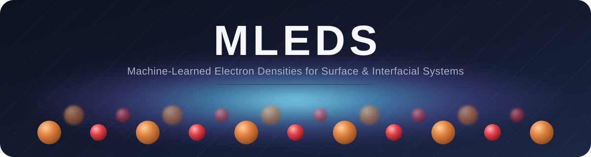

<p align="center">
  
</p>

# MLEDS

**Assessing the Physical Fidelity of Machine-Learned Electron Densities for
Surface and Interfacial Systems**

Configs, data-conversion scripts, and driver-code patches used to train and
evaluate a charge3net-based model for predicting electron density on CuxO
(CuO / Cu2O) bulk structures, as reported in the manuscript above. Covers
model training/inference end-to-end; DFT calculation, post-processing, and
property-evaluation code is included as minimal runnable templates rather
than the full production pipeline (see below for what that means in practice).

## Repository structure

```
mleds/
├── configs/
│   ├── train.yaml             # Hydra configs
│   ├── test_probes.yaml       # NMAE on sampled probes
│   ├── test_chgcar.yaml       # full-grid density cube prediction
│   ├── model/e3_density.yaml
│   ├── data/
│   │   ├── mp_data.yaml
│   │   └── graph_constructor/kdtree.yaml
│   └── dft/                   # generic VASP INCAR/KPOINTS template
├── run/
│   ├── preprocess_data.sh     # SLURM launch scripts
│   ├── train.sh
│   ├── test_probes.sh
│   └── dft/single_structure.sh
├── scripts/
│   ├── ...                    # data conversion / split / QC (ML side)
│   ├── dft/generate_potcar.sh
│   ├── postprocessing/        # density-error / gradient / force-energy descriptors
│   └── property_evaluation/   # dipole + Bader charge comparison
└── src_patch/                 # overlay onto a charge3net checkout's src/
```

## Dependency

This code is built on top of [charge3net](https://github.com/AIforGreatGood/charge3net)
(MIT License, Copyright (c) 2023 Massachusetts Institute of Technology). It is
not a redistribution of that package — only the parts specific to the CuxO
bulk workflow are included here. To use this repo:

1. Clone charge3net and follow its README to set up the `charge3net` conda
   environment.
2. Copy `src_patch/` on top of that checkout's `src/` directory (it patches
   `trainer.py`, `test.py`, `test_from_config.py`,
   `charge3net/data/dataset.py`, `utils/data.py`, and `utils/predictions.py`
   — see "What's patched" below).
3. Copy `configs/` and `scripts/` into the checkout root (or point the
   commands below at wherever you placed them).

## What's patched, and why

`src_patch/` carries a small number of changes on top of stock charge3net:

- `trainer.py`, `test.py`, `test_from_config.py`: support for
  `defer_cube_materialization` (skip combining per-shard prediction cubes
  until a later step, useful for very large grids) and a SLURM-aware
  distributed init port (`resolve_master_port`) so concurrent jobs on a
  shared cluster don't collide on the default port.
- `charge3net/data/dataset.py`: a `filelist.txt` data root is always treated
  as a pickled-density directory (`DensityPickleDir`), matching the data
  layout used here.
- `utils/data.py`, `utils/predictions.py`: electron-count bookkeeping
  (`compute_electron_count`, `get_density_normalization_metadata`,
  `normalize_density_to_electron_count`) used by the CHGCAR conversion
  scripts and by `scripts/check_predicted_density_normalization.py` to
  sanity-check that predicted density cubes integrate to the correct number
  of electrons.

Model architecture (`e3.py`, `densitymodel.py`) is unmodified from charge3net
and is not duplicated here — install it from the upstream repo.

Everything else in `scripts/` and `src_patch/` carries at least one real
change from upstream (a new flag, a bug fix, or new functionality this
workflow relies on) — the exception is `scripts/write_dummy_split.py`, which
is included unmodified purely because `convert_chgcar_dir_to_pkl_dir.py`
imports it directly and it's easier to keep the repo self-contained.

## Workflow

1. **Raw CHGCAR -> pickled density/atoms + filelist** (`run/preprocess_data.sh`,
   `scripts/batch_convert_to_npy.py`, `scripts/write_mp_probe_count_file.py`).
   For converting or reconverting a specific subset of structures (rather
   than an entire raw-data directory), use
   `scripts/convert_chgcar_dir_to_pkl_dir.py --input-list <path>` instead.
2. **Train/val/test split**: `scripts/write_mp_datasplits.py` writes
   `split.json` from `filelist.txt`, stratified by de-duplicated
   composition/space group. `configs/train.yaml` and the test
   configs expect the split at `./data/mp/split_v2.json`, so rename/copy the
   script's output accordingly (or pass a different `split:` value in the
   config). The split is index-based (positions into `filelist.txt`), so
   re-converting individual entries in place (step 1) does not require
   regenerating the split.
3. **Train**: `run/train.sh` (`configs/train.yaml`).
4. **Evaluate on sampled probes**: `run/test_probes.sh`
   (`configs/test_probes.yaml`), reports NMAE on 1000 probes/structure.
5. **Full-grid inference**: `configs/test_chgcar.yaml`, for
   producing a complete predicted density cube per structure (input
   directory needs its own `filelist.txt`, `split.json`, `probe_counts.csv`).
6. **Cube -> CHGCAR** (for DFT-comparison / visualization):
   `scripts/convert_pkl_to_chgcar.py`.
7. **QC**: `scripts/check_predicted_density_normalization.py` checks that
   predicted cubes integrate to the expected electron count within
   tolerance.

Set `--account`/`--qos`/`--partition` in the `run/*.sh` scripts for your
cluster before submitting.

## DFT calculations, post-processing, and property evaluation

The three sections below are **minimal, generic templates and worked
examples**, not the production pipeline that generated every number in the
manuscript. They contain no structure names, POSCARs, CHGCARs, or other data
from the actual CuxO bulk dataset — every script takes file paths as
arguments so you can point it at your own structure(s). This is a deliberate
scope choice: it's enough to reproduce the *method* end-to-end on a
structure of your own, without checking in the full validation set or the
multi-category dispatch/aggregation machinery used to batch-process it.

**DFT calculations** (`configs/dft/`, `scripts/dft/`, `run/dft/`) — a
single-structure VASP ground-truth workflow:
- `configs/dft/INCAR`, `configs/dft/KPOINTS`: the DFT settings used for CuxO
  bulk single-point calculations (PBE, ENCUT 450 eV, DFT-D3, 4x4x3
  Monkhorst-Pack via 0.03 K-spacing). Drop these next to your own `POSCAR`.
- `scripts/dft/generate_potcar.sh`: concatenates a POTCAR from your local
  VASP pseudopotential distribution (`POTCAR_DIR=... ./generate_potcar.sh Cu
  O`). POTCAR files are licensed with VASP and are **not** included here —
  you need your own installation.
- `run/dft/single_structure.sh`: SLURM submission template for one
  structure. Set `--account`/`--qos`/`--partition` and the VASP module for
  your cluster.

**Post-processing** (`scripts/postprocessing/`) — turning a predicted
density + a ground-truth CHGCAR into physically-motivated error metrics, for
one structure at a time:
- `compute_density_error.py`: absolute/RMSE/NMAE density error.
- `compute_gradient_descriptors.py`: density-gradient and reduced-gradient
  (RDG) descriptors, including gradient-weighted error localization.
- `compute_force_energy_descriptors.py`: the Hartree self-energy of the
  density error (a 2nd-order proxy for energy error) and per-atom
  Hellmann-Feynman-integrand descriptors (a proxy for force error), given
  SCF/NSCF energy+force JSON for the structure.

**Property evaluation** (`scripts/property_evaluation/`) — physical
properties derived from the density:
- `compute_dipole_and_bader.py`: dipole moment and Bader charges (via the
  external [`bader`](http://theory.cm.utexas.edu/henkelman/code/bader/)
  code) for predicted vs. ground-truth densities of one structure.
- Work function/dipole-correction analysis is intentionally **not**
  included here — it does not apply to bulk structures (no vacuum), and the
  actual work-function pipeline in the source repo targets CuxO *surface*
  slabs, a different system from this bulk study.

## License

MIT — see [LICENSE](LICENSE). Carried over from charge3net; this repo's own
additions are released under the same terms.
